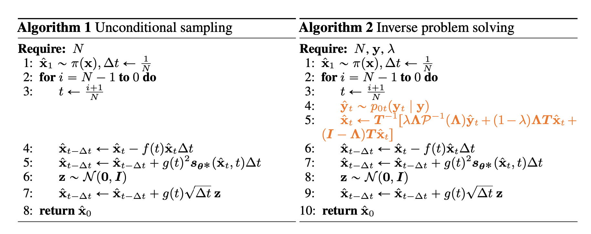

# 2023.10.8
question: for diffusion model applied for inverse modeling, why it can decrease the required number of projections

points:
1. for CT example, we can train proxy model using dataset with datapair(measurement, image). But the utilization of the trained proxy are restricted by measurement setup (e.g. once number of measurements or locations of measurements change, we need to regenerate dataset and retrain the model)
2. the reason a generative model can help for inverse problem is that it implicitely provides a prior distribution. So we don't need to perform reconstruction from scratch.

3. the porposed approach apply for linear measurements, since decomposition is rquired

4. - [ ] first task, trying to use geo-model realiations for diffusion model, understand the process while repeating the original code 

5. regrading decreasing the number of messrements, no therotical provement or insight is provided in this paper, the author provides statitically comparison. However, this process has a nice property that we don'e need to fix the measurements setup.

